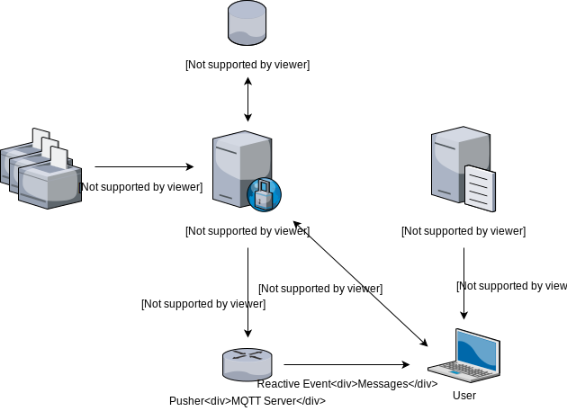

# Demo slides

---

## Peter Olofsson

### Working with SW
<!-- .slide: style="text-align: left;"> -->
<i class="fab fa-twitter"></i><a href="https://twitter.com/none">  @none</a> 
<i class="fas fa-envelope"></i>  peter@none.com 
<i class="fab fa-github"></i><a href="https://github.com/polozon">  github.com/polozon</a>

---

## Agenda
<!-- .slide: style="text-align: left;"> -->
- Something 1 
- Something 2 
- Something 3 

---

## Control Groups
<!-- .slide: style="text-align: left;"> -->
Bla bla 
resources of the host 
 
Implements resource limiting of:-
- Machine
- Server

---

## Default networks
<!-- .slide: style="text-align: left;"> -->

- machine 
- backend 
- frintend 

## Options for persisting data
<!-- .slide: style="text-align: left;"> -->
- Bind mounts 
- Data volume containers 
- Named volumes

---

## Stepping code

<pre><code data-line-numbers="1|3|5-8|10|12|14">FROM mcr.microsoft.com/mssql/server:2019-CU5-ubuntu-18.04

USER root

RUN mkdir /var/opt/sqlserver
RUN mkdir /var/opt/sqlserver/sqldata
RUN mkdir /var/opt/sqlserver/sqllog
RUN mkdir /var/opt/sqlserver/sqlbackups

RUN chown -R mssql /var/opt/sqlserver

USER mssql

CMD /opt/mssql/bin/sqlservr
</pre></code>

---

# Demo

---

# Docker Compose

---

## Docker container run

<pre><code data-line-numbers="1|2|3-8|9|10-13|14|15">docker container run -d
--publish 15789:1433
--env SA_PASSWORD=Testing1122
--env ACCEPT_EULA=Y
--env MSSQL_AGENT_ENABLED=True
--env MSSQL_DATA_DIR=/var/opt/sqlserver/sqldata
--env MSSQL_LOG_DIR=/var/opt/sqlserver/sqllog
--env MSSQL_BACKUP_DIR=/var/opt/sqlserver/sqlbackups
--network sqlserver
--volume sqlsystem:/var/opt/mssql
--volume sqldata:/var/opt/sqlserver/sqldata
--volume sqllog:/var/opt/sqlserver/sqllog
--volume sqlbackup:/var/opt/sqlserver/sqlbackups
--name sqlcontainer1
mcr.microsoft.com/mssql/server:2019-CU5-ubuntu-18.04
</pre></code>

---

## What is Compose?
<!-- .slide: style="text-align: left;"> -->
"Compose is a tool for defining and running multi-container Docker applications.
With Compose, you use a YAML file to configure your application`s services.
Then, with a single command, you create and start all the services from your configuration." 
<a href="https://docs.docker.com/compose/">docs.docker.com/compose</a>

---

# Demo

---

## Resources
<!-- .slide: style="text-align: left;"> -->

<a href="https://github.com/dbafromthecold/DockerDeepDive">https://github.com/dbafromthecold/DockerDeepDive</a> 
<a href="http://tinyurl.com/y3x29t3j/summary-of-my-container-series">http://tinyurl.com/y3x29t3j/summary-of-my-container-series</a> 
<a href="https://github.com/dbafromthecold/SqlServerAndContainersGuide">https://github.com/dbafromthecold/SqlServerAndContainersGuide</a>

